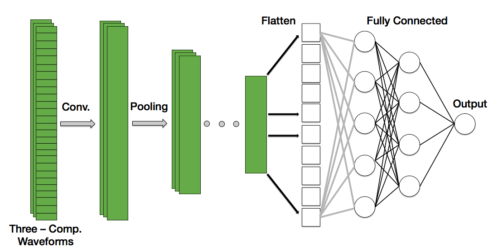
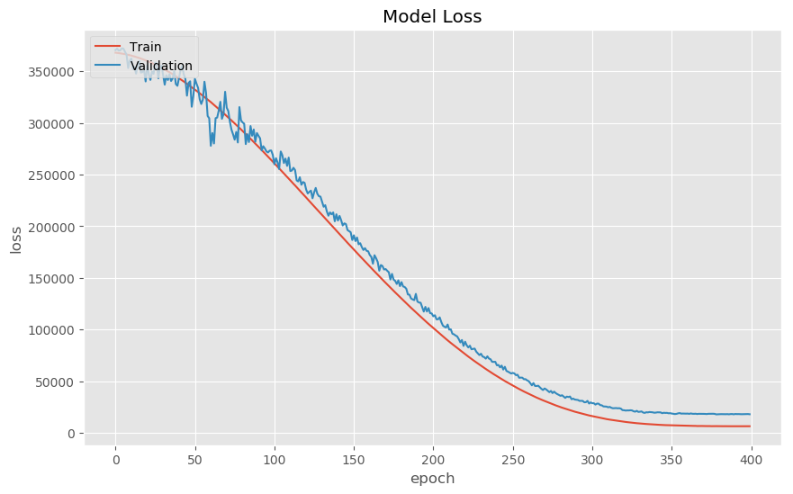
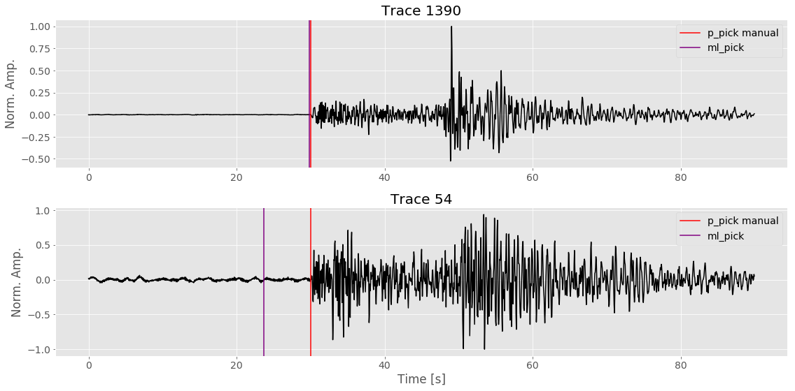

---


This is the second of two Jupyter Notebooks. In Part I we will cover the first steps of the machine learning pipeline: <b>Framing the Problem</b>, <b>Retrieving the Data </b>, <b>Exploring and Understanding your Data</b>, and <b>Processing the Data for training </b>.  

In this notebook we will go sraight into <b>compiling</b>, <b>training</b>, and <b>evaluating</b> a baseline convolutional neural network.  We'll end by going over what still needs to be done before we can consider this model ready for deployment.  

<h2>Table of Contents</h2>

* [Read Data In](#read_data)
* [A Convolutional Neural Network Baseline](#cnn_baseline)
* [Training Model](#train_model)
* [Interpreting the Results](#interpreting_results)
* [Visualizing the Results](#visualize_results)
* [What's Next](#whats_next)
* [Conclusion](#conclusion)

<br>
To begin, let's import some modules and functions that will be useful later: 

```python
import os
import numpy as np
import pandas as pd
from random import randint
from keras.layers import Input, Dense
from keras.layers import Conv1D, MaxPooling1D, UpSampling1D
from keras.layers.normalization import BatchNormalization
from keras.layers import Dropout, Activation, Flatten
from keras.models import Model
from keras.models import model_from_json

import matplotlib.pyplot as plt
plt.style.use('ggplot')
```

```python
def form_WAVsaved_npz(data_array):
    tmp_list = []
    for array in data_array:
        tmp_list.append(data_array[array])

    # Convert to Numpy array
    # (# of instances, # of features)
    data_array = np.array(tmp_list)  

    # From (1, 7156, 3, 1800) to (7156, 3, 1800)
    data_array = data_array.reshape(data_array.shape[1], data_array.shape[2], data_array.shape[3])

    return data_array

def format_Psaved_npz(label_array):
    tmp_list = []
    for array in label_array:
        tmp_list.append(label_array[array])

    # Convert to Numpy array
    # (# of instances, # of features)
    data_array = np.array(tmp_list)  

    # (1, #samples, labels)
    labels = data_array.reshape(data_array.shape[1])
    
    return labels
```

<br>
<h2><a name='read_data'>Read Data In</a></h2>

For this model we are using the data saved from our pre-processing efforts. There are a few different file formats for storing time-series data. Probably the most common file format you'll come across are [HDF5](https://www.hdfgroup.org/solutions/hdf5/) (Hierarchical Data Format) and NumPy's .npz, which is NumPy's way of saving arrays into a compressed file format. For this tutorial we will use .npz files.  

There are two files to read in: time-series waveforms and the arrival times of the first arriving (P-Phase) seismic wave. The latter of which are the labels we are using for our training model. Simply use <span style="font-family:Courier; font-size:1.0em;">np.load()</span> to read both .npz files in.  Once the files are read we'll store them into NumPy arrays. I've written a function to then take this  <span style="font-family:Courier; font-size:1.0em;">numpy.lib.npyio.NpzFile</span> and store it into a NumPy array.


```python
# Let's read this in and check it is right.
data_waves = np.load("./pre_process/waveforms.npz")
data_labels = np.load("./pre_process/labels.npz")   # labels

data_array = form_WAVsaved_npz(data_waves)

p_arrivals = format_Psaved_npz(data_labels)
```

To make our lives easier, we'll also assign the number of traces, the number of features, and the number of sample points to variables 
<span style="font-family:Courier; font-size:1.0em;">num_traces</span>, <span style="font-family:Courier; font-size:1.0em;">num_feat</span>, and <span style="font-family:Courier; font-size:1.0em;">npts</span>, respectively.


```python
# Number of traces
num_traces = data_array.shape[0]   # e.g. (1, 5, 3)

# Index of feature we want.
num_feat   = data_array.shape[2]

# npts
npts = data_array.shape[1]
```

We need to set aside some of our data set for training and set the remaining bit as our validation set.  The size of your data set determines what ratio of training to validation you'll want to use. For "smaller" data sets it is common to use 80% of your data set for training and set aside the other 20% for validation. If you have a data set in the millions, then you'll probably end up using 10% of your data for validation and the rest for training. 

To split our data set I am simply setting  
<center><span style="font-family:Courier; font-size:1.0em;">TRAIN_TEST_SPLIT = 0.2</span></center>  

In other words, keep 80% for training.


```python
# Split data into training and validation 
# The percent of data that will be included in the test set (here 20%)
TRAIN_TEST_SPLIT = 0.2

# TRAIN/VAL split 
nr_val_data = int(num_traces * TRAIN_TEST_SPLIT)

x_train = data_array[nr_val_data:, :] # x composed of two traces
y_train = p_arrivals[nr_val_data :] # y values has the s-arrival time

x_val  = data_array[:nr_val_data, :]
y_val  = p_arrivals[: nr_val_data]
```

---

<h2><a name = 'cnn_baseline'>A Convolutional Neural Network Baseline</a></h2>

We have read our data in, formatted into NumPy arrays, and we just split the data into a training and validation training set. Let's define our deep neural network!  As stated in the title of this blog, we will be using convolutional neural networks (CNN). Among other things, CNN are designed to handle grid-like data such as time-series data and images. Alternatively, we could use a type of Recurrent Neural Network (RNN), which can also handle data with spatial-temporal dependencies, however let's stick to CNNs as they are currently one of the most popular models in the field of Computer Vision.

To create our convolutional neural network model we will use [Keras](https://keras.io/) which is a high-level neural network API. It is fairly straight forward to use and the community supporting Keras is robust.  


<br>
<h3>Hyperparameter Choice</h3>  

Unfortunately, there does not exist a set of rules which will tell you what hyperparameters you should use. The process of fine-tuning your model is empirical and requires a lot of trial and error.  However, that doesn't mean you should start choosing randomly; read what model configurations is working for other groups and do a little homework on which parameters are appropriate.  

In our case we will use the following:  


* Mini batches of 256 [memory on computers is stored in 2's, so batches of a power of 2 helps train a little faster]  
* 400 epochs [let's just start with this]  
* Filters size of 32 and 64  
* Kernel size of size 6
* Pool size of 2  
* Rectified linear unit (ReLU) activation function for the hidden layers 
* Linear activation function for the output layer [we want an activation function which can give us values between -1 to 1]
* Mean squared error loss function  
* Adam optimizer [best of RMSprop and gradient decent with momentum]


If you have experience using convolutional neural networks, you'll note that as input we can specify more than one channel. In the case of color images we define, and give as input, three channels as input: red, green, and blue. Hence, our input will have dimension:

<centre><span style="font-family:Courier; font-size:1.0em;">(# training examples, number of samples, # of channels)</span></centre>. 

The data recorded by the seismometers record motion in three directions: a vertical(up-down) and two horizontal motions (N-S and E-W). Thus, for each training example we will give our neural network not just one, but three waveforms. Thus, our input array will have three channels. Below is an illustration of what our CNN looks like:


<b>Figure:</b> Schematic of 1D convolutional neural network used to identify the first-arriving phase arrival of an earthquake. Note that each instance is composed of three channels, one for each component measuered by the seismometer (Vertical, North-South, East-West).

For the sake of brevity, I'll omit commentary on how we chose the number of hidden layers and the filter size (or sometimes referred to as 'kernels') in this blog. I'll make a separate blog detailing the knitty-gritty details of how convolutional neural networks work.  

With this in mind let's go ahead and make our convolutional neural network. Our input array, <span style="font-family:Courier; font-size:1.0em;"> x_train</span>, has input dimension of:  


We'll need to specify this for our model (see variable <span style="font-family:Courier; font-size:1.0em;">input_trace</span>). Below is a summary of our model. Each line describes a hidden layer and it's associated number of weights and parameters.


```python
# Hyperparameters 
batch_size = 256
epochs     = 400
filters    = [32, 64]
kernel_size = 6
pool_size = 2
padding = 'same'
hidden_act_fun = 'relu'
final_act_fun  = 'linear'
optimizer = 'adam'
loss_type = 'mean_squared_error' 
name = 's_phase_picker'

## MODEL ##
# Input placeholder
input_trace = Input(shape=(x_train.shape[1], x_train.shape[2]))  
x = Conv1D(filters = filters[0], kernel_size = kernel_size, activation=hidden_act_fun, padding = padding)(input_trace)
x = MaxPooling1D(pool_size = pool_size, padding = padding)(x)
x = Conv1D(filters = filters[1], kernel_size = kernel_size, activation=hidden_act_fun, padding = padding)(x)
x = MaxPooling1D(pool_size = pool_size, padding = padding)(x)
cnn_feat = Flatten()(x)

x = Dense(units= 32, activation=hidden_act_fun)(cnn_feat)
x = BatchNormalization()(x)
x = Dense(units = 8, activation=hidden_act_fun)(x)
x = BatchNormalization()(x)
dense = Dense(units= 1, activation=final_act_fun)(x)

# Compile Model
p_phase_picker = Model(input_trace, dense, name = name)
p_phase_picker.compile(optimizer = optimizer, loss = loss_type)
p_phase_picker.summary()
```

    _________________________________________________________________
    Layer (type)                 Output Shape              Param #   
    =================================================================
    input_1 (InputLayer)         (None, 1800, 3)           0         
    _________________________________________________________________
    conv1d_1 (Conv1D)            (None, 1800, 32)          608       
    _________________________________________________________________
    max_pooling1d_1 (MaxPooling1 (None, 900, 32)           0         
    _________________________________________________________________
    conv1d_2 (Conv1D)            (None, 900, 64)           12352     
    _________________________________________________________________
    max_pooling1d_2 (MaxPooling1 (None, 450, 64)           0         
    _________________________________________________________________
    flatten_1 (Flatten)          (None, 28800)             0         
    _________________________________________________________________
    dense_1 (Dense)              (None, 32)                921632    
    _________________________________________________________________
    batch_normalization_1 (Batch (None, 32)                128       
    _________________________________________________________________
    dense_2 (Dense)              (None, 8)                 264       
    _________________________________________________________________
    batch_normalization_2 (Batch (None, 8)                 32        
    _________________________________________________________________
    dense_3 (Dense)              (None, 1)                 9         
    =================================================================
    Total params: 935,025
    Trainable params: 934,945
    Non-trainable params: 80
    _________________________________________________________________


---

<h2><a name='train_model'>Training the Model</a></h2>

With our data read in and our model architecture defined, we are now ready to run our baseline convolutional neural network.  In Keras this amounts to giving our compiled model the training data set and its associated labels, the number of epochs and batch size we want, and the validation set as shown below:


```python
# Train Model
history = p_phase_picker.fit(x = x_train,
                            y = y_train,
                            epochs= epochs,
                            batch_size=batch_size,
                            validation_data=(x_val, y_val))

# Keep track of the last loss values (for easy comparison later)
train_loss = history.history['loss']
last_train_loss_value = train_loss[len(train_loss)-1]
val_loss = history.history['val_loss']
last_val_loss_value = val_loss[len(val_loss) - 1]
```
```python
Epoch 1/400
5725/5725 [==============================] - 4s 780us/step - loss: 367974.3419 - val_loss: 370470.2668
Epoch 2/400
5725/5725 [==============================] - 4s 632us/step - loss: 367804.4836 - val_loss: 371916.8610
Epoch 3/400
5725/5725 [==============================] - 4s 624us/step - loss: 367594.1336 - val_loss: 370046.7134
Epoch 4/400
5725/5725 [==============================] - 4s 635us/step - loss: 367357.8737 - val_loss: 370197.6924
Epoch 5/400
5725/5725 [==============================] - 4s 647us/step - loss: 367116.8329 - val_loss: 372166.2775
Epoch 6/400
5725/5725 [==============================] - 4s 645us/step - loss: 366859.2670 - val_loss: 371878.3604
Epoch 7/400
5725/5725 [==============================] - 4s 651us/step - loss: 366575.9700 - val_loss: 368855.4593
Epoch 8/400
5725/5725 [==============================] - 4s 644us/step - loss: 366252.4366 - val_loss: 365949.0822
Epoch 9/400
5725/5725 [==============================] - 4s 643us/step - loss: 365918.8507 - val_loss: 353128.8180
Epoch 10/400
5725/5725 [==============================] - 4s 640us/step - loss: 365568.8157 - val_loss: 360134.3884
Epoch 11/400
5725/5725 [==============================] - 4s 643us/step - loss: 365160.4010 - val_loss: 362235.5229
Epoch 12/400
5725/5725 [==============================] - 4s 641us/step - loss: 364738.2535 - val_loss: 352015.1630
Epoch 13/400
5725/5725 [==============================] - 4s 641us/step - loss: 364275.2614 - val_loss: 354300.4198
Epoch 14/400
5725/5725 [==============================] - 4s 634us/step - loss: 363814.7165 - val_loss: 347660.5830
Epoch 15/400
5725/5725 [==============================] - 4s 636us/step - loss: 363339.9869 - val_loss: 357162.0319
Epoch 16/400
5725/5725 [==============================] - 4s 640us/step - loss: 362818.9280 - val_loss: 359878.0607
Epoch 17/400
5725/5725 [==============================] - 4s 637us/step - loss: 362306.8130 - val_loss: 348699.6071
Epoch 18/400
5725/5725 [==============================] - 4s 640us/step - loss: 361731.6002 - val_loss: 349205.2539
Epoch 19/400
5725/5725 [==============================] - 4s 636us/step - loss: 361150.4833 - val_loss: 351060.9939
Epoch 20/400
5725/5725 [==============================] - 4s 635us/step - loss: 360559.7594 - val_loss: 340123.2790
.
.
.
Epoch 385/400
5725/5725 [==============================] - 4s 637us/step - loss: 6572.9224 - val_loss: 18183.6428
Epoch 386/400
5725/5725 [==============================] - 4s 635us/step - loss: 6540.7187 - val_loss: 18267.0756
Epoch 387/400
5725/5725 [==============================] - 4s 635us/step - loss: 6536.7624 - val_loss: 18081.5158
Epoch 388/400
5725/5725 [==============================] - 4s 634us/step - loss: 6536.4518 - val_loss: 18305.2634
Epoch 389/400
5725/5725 [==============================] - 4s 637us/step - loss: 6549.2467 - val_loss: 18346.6905
Epoch 390/400
5725/5725 [==============================] - 4s 639us/step - loss: 6537.4118 - val_loss: 18083.2445
Epoch 391/400
5725/5725 [==============================] - 4s 635us/step - loss: 6526.0619 - val_loss: 18387.9119
Epoch 392/400
5725/5725 [==============================] - 4s 639us/step - loss: 6508.7915 - val_loss: 18279.9480
Epoch 393/400
5725/5725 [==============================] - 4s 633us/step - loss: 6522.6132 - val_loss: 18310.2310
Epoch 394/400
5725/5725 [==============================] - 4s 635us/step - loss: 6518.6792 - val_loss: 18221.4595
Epoch 395/400
5725/5725 [==============================] - 4s 636us/step - loss: 6532.9096 - val_loss: 18169.3012
Epoch 396/400
5725/5725 [==============================] - 4s 638us/step - loss: 6525.6210 - val_loss: 18193.7779
Epoch 397/400
5725/5725 [==============================] - 4s 636us/step - loss: 6519.6705 - val_loss: 18258.7685
Epoch 398/400
5725/5725 [==============================] - 4s 632us/step - loss: 6517.0802 - val_loss: 18250.5715
Epoch 399/400
5725/5725 [==============================] - 4s 633us/step - loss: 6516.5765 - val_loss: 18335.3135
Epoch 400/400
```


---

<h2><a name ='interpreting_results'>Interpreting the Results</a></h2>  

What does the above tell us? For each epoch the Keras API prints:   

1) Computation time  
2) The loss from the training and validation data sets.  

The second point here is worth spending some time thinking about. Remember that the overall objective is to create an algorithm which learns from the data we give it. i.e. we want our algorithm to generalize to data it has never seen before.  We should expect, therefore, that the training loss decreases for every epoch. Does this happen in our case? Let's plot the training and validation loss curves (sometimes called 'learning curves') to help us understand a little more of how well our deep neural network performed:   


```python
# Validation loss curves #
fig, axes = plt.subplots(nrows = 1, ncols = 1, figsize = (10,6))
axes.plot(history.history['loss'])
axes.plot(history.history['val_loss'])
axes.set_title('Model Loss')
axes.set_ylabel('loss')
axes.set_xlabel('epoch')
axes.legend(['Train', 'Validation'], loc='upper left')
```


<b>Figure:</b> Learning curve results from training 1D convolutional neural network with the above-mentioned hyper parameters. Red curve depicts loss from training set, blue curve depicts loss from validation set.  

The red and blue curves show the loss (sometimes called 'cost') per epoch on the training and validation set, respectively.  As expected, the neural network performs poorly at the onset of training(at this point the model is probably randomly guessing where the first phase is) and gradually improves with epoch. During training the neural network is learning directly from the training set, so the prediction error (loss/cost) is lower than that of the validation training set.  

We stopped training around epoch <span style="font-family:Courier; font-size:1.0em;">400</span> because at this point it would seem our neural network is no longer learning/improving its ability to make predictions. Also, we don't want to let the neural network run too long, else the neural network might begin to over fit. 

---

<h2><a name ='visualize_results'>Visualize the Results</a></h2>  

I don't know about you, but most of the tutorials I come across normally end here. Meaning, they show a loss curve from training and call it a day. I am a visual person, so I want to see what the output of my model gave me. Sure, these learning curves tell me that, to a first order that my neural network is learning to pick the first arrival. But, how does this look compared to the pick made by a human being? Let's look at some earthquakes.  

Below I have plotted two randomly (using Numpy's <span style="font-family:Courier; font-size:1.0em;">rand.randint()</span> function) chosen waveforms from our validation set.  The red vertical line is the pick made by a humanoid. The purple line is the pick made by our CNN.  


```python
def read_results(file_name):
    file_npz = np.load(file_name)
    
    read_list = []
    for item in file_npz:
        read_list.append(file_npz[item])
    
    return np.array(read_list)
```


```python
directory = './data_directory'

## Read in earthquake waveforms
file = "waves4picking.npz"
file_path = os.path.join(directory, file)
waves_array = read_results(file_path)
# Reshape from (1, 1431, 1800, 3) to (1431, 1800, 3)
waves_array = np.reshape(waves_array, newshape=(waves_array.shape[1], waves_array.shape[2], waves_array.shape[3]))


## Read picks made by people
file2 = "spicks_used.npz"
file_path2 = os.path.join(directory, file2)
ppick_array = read_results(file_path2)
ppick_array = np.reshape(ppick_array, newshape=(ppick_array.shape[1])) # Reshape from (1, 1431) to (1431,)


## Picks made by machine learning
file3 = 'ml_spicks.npz'
file_path3 = os.path.join(directory, file3)
ml_ppicks = read_results(file_path3)
ml_ppicks = np.reshape(ml_ppicks, newshape=(ml_ppicks.shape[1]))    # Reshape from (1, 1431) to (1431,)
```


```python
# Waveform specs.
sampling_rate = 20.0
npts = 1800 
delta = 0.05
time = np.arange( 0, npts / sampling_rate, delta)
```


```python
# Let's select waveforms, and their associated picks, randomly
tr = np.random.randint(0, waves_array.shape[0])
tr1 = np.random.randint(0, waves_array.shape[0])

rows = 2
fig, axes = plt.subplots(nrows=2, ncols=1, figsize=(16,8))
axes[0].set_title("Trace {}".format(tr))
axes[0].plot(time, waves_array[tr, :, 0], color = 'black')
axes[0].axvline(ppick_array[tr] / sampling_rate, color = 'red', label = "p_pick manual")
axes[0].axvline(ml_ppicks[tr] / sampling_rate, color = 'purple' , label = 'ml_pick')

axes[1].set_title("Trace {}".format(tr1))
axes[1].plot(time, waves_array[tr1, :, 0], color = 'black')
axes[1].axvline(ppick_array[tr1] / sampling_rate, color = 'red', label = "p_pick manual")
axes[1].axvline(ml_ppicks[tr1] / sampling_rate, color = 'purple' , label = 'ml_pick')
axes[1].set_xlabel("Time [s]")

for i in range(rows):
    axes[i].set_ylabel('Norm. Amp.')
    axes[i].legend()
    
plt.tight_layout()
```



<b>Figure:</b> Two randomly chosen earthquake seismic records from the training set. The red vertical line is the manually selected phase arrival. The purple line depicts the phase pick made by the machine learning algorithm after training.

<br>
You'll notice that, depending on the waveform, our CNN has varying levels of success in picking the first arrival.  This makes sense given that so far we have only run a baseline model; there is still plenty of refining and polishing that has to be done before we can expect too much from our neural network.  

What's left do? We'll explore this in the next section.

---

<h2><a name ='whats_next'>What's Next?</a></h2>

There's loads to do before we can call this model satisfactory. For a start, we should try to get more data. The model results shown above only used ~10,000 waveforms, which is a bit on the small side for a deep neural network. It might be instructive to try to double or triple this and see if our loss curves improve.  

We could also play with the complexity of our model. At the moment we only have two 1D convolutional layers. Perhaps the model will perform better with more or larger filter sizes? (<b>Warning:</b> it is best practice to start small before jumping into larger models!)

One could and should explore the batch sizes and/or using a different optimization method.  

We could and should shift the window of where our seismic waveform is centered. Not only might this make our neural network more robust, it will increase how much training data we have (i.e. data augmentation).

Once we have reached a point where we are satisfied with how our model is performing we will need to run this on a <b>test set</b>. In other words, we need to run this on a data set which the convolutional neural network has never seen before. To do this, simply leave a fraction (maybe 1/10th) of your entire data set and save it for later use. Once you have your model parameters, simply load them in and run it on your test set. Keras makes this very easy to do and I'll go into detail in a future post of how to do this.

---

<h2><a name ='conclusion'>Conclusion</a></h2>

In this tutorial we covered how to <b>compile</b>, <b>train</b>, and make a surface-level <b>evaluation</b> of a baseline convolutional neural network.  In the first part of the tutorial we learned how to frame our problem, download data, process it, and save it into a file format from which we could use for training our convolutional neural network.

Identifying the first arriving seismic wave generated by an earthquake is a critical component of earthquake early warning and it is a topic that is of continued interest from both a scientific and public safety point of view. As of writing this post, earthquake early warning has recently received more funding to support operations, improve existing seismic stations, and expand the current earthquake early warning system on the West Coast.  

While there exists non-machine learning earthquake detection systems, it remains to be seen if deep neural networks can not only classify and detect earthquakes, but do so more accurately and faster than current detection algorithms which do not use DNN.  
 

---
---

<h3>Suggested Reading Material</h3>  

* Géron, A. (2017). Hands-On Machine Learning with Scikit-Learn and TensorFlow: Concepts, Tools, and Techniques for Building Intelligent Systems. O'Reilly UK Ltd.  

* Stanford CS class CS231n: [Convolutional Neural Networks for Visual Recognition](http://cs231n.github.io/). 

* Ackermann, Nils. "Introduction to 1D Convolutional Neural Networks in Keras for Time Sequences" <i>Medium</i>, 04 September 2018, https://blog.goodaudience.com/introduction-to-1d-convolutional-neural-networks-in-keras-for-time-sequences-3a7ff801a2cf

---
---